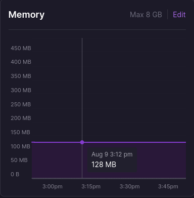
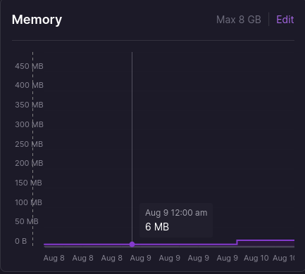

# Blog

> I have [another repo](https://github.com/ManeeshWije/blog) for this blog except the backend was written in Bun + Hono. The reason for this rewrite is that Bun took up too much memory on Railway so I decided to rewrite it in Rust

-   Simple blog site written in Axum (Rust), HTMX, and Handlebars templating
-   Posts are written and stored locally, then the server parses them on start, and stores relevant info of each one in Postgres
-   Styled using TailwindCSS

### TODO:

-   [ ] implement infinite scroll when I have more articles
